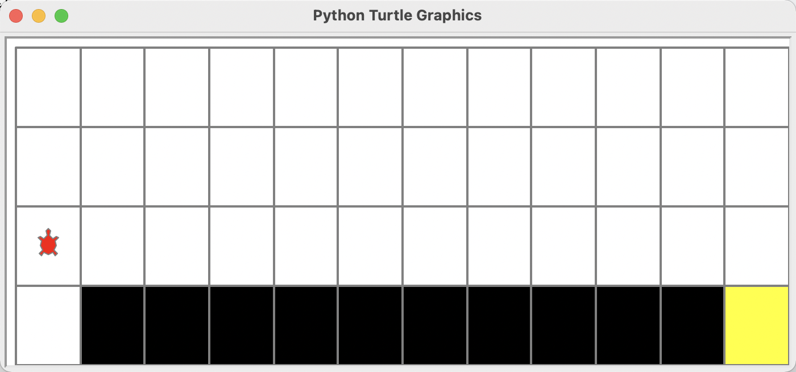
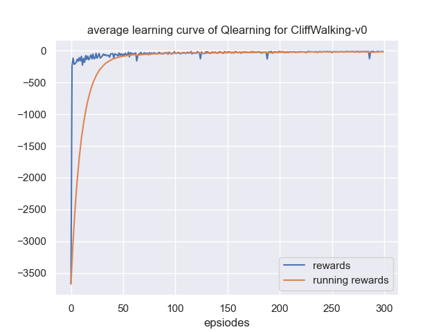

# 使用Q表格方法解决迷宫寻路问题
运动规划是强化学习一个较为常见的应用场景，这次实验我们的任务是使用强化学习中的`Q-表格` 方法解决一个简单的迷宫寻路问题。该算法的应用场景是开源环境库gym中的**CiffWalking-v0**环境。


## CiffWalking-v0环境
该环境的大小是一个4*12的网格，智能体以网格的左下角位置为起点，以网格的右下角位置为终点，目标是移动智能体到达终点位置，智能体每次可以在上、下、左、右这4个方向中移动一步，每移动一步会得到-1单位的奖励，也即总步数更少的智能体获得的奖励值回越高。实验的仿真页面如下：

在实验中：
- 智能体不能移动出网络，如果下一步的动作命令会让智能体移动出边界，那么这一步命令不会执行，并会得到-1的奖励
- 如果智能体掉入悬崖（仿真环境中黑色的色块），会立即回到出生点并得到-100的奖励
- 当智能体移动到终点时，该回合结束。
- 由图可知，最优的路线需要13步，所以最后智能体获得的奖励指在-13左右为最佳结果。


## 任务要求
本实验已经提供了强化学习基本的训练接口和可视化，只需要实现Q表格的强化学习方法即刻，训练目标是在评价阶段，智能体的平均奖励必须达到-13。


## 需要完成的算法部分

```
./agent.py 
choose_action()
update()
```

## 所需安装包

```{bash}
gym 
turtle
numpy
torch 
pathlib
```
