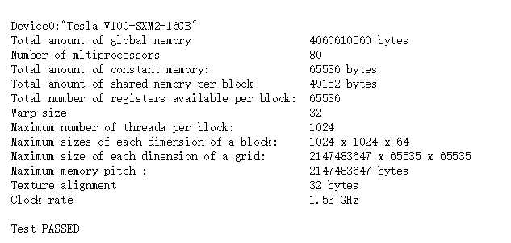
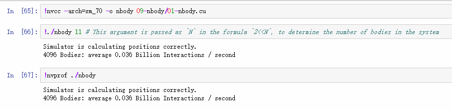
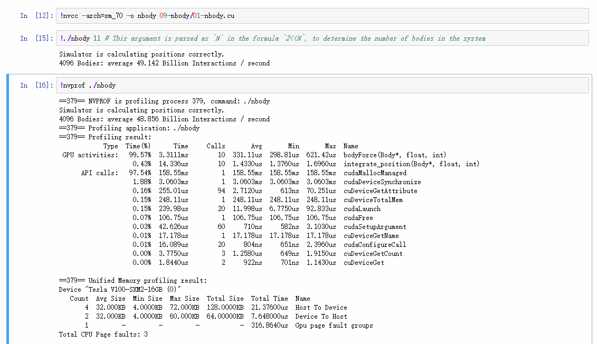
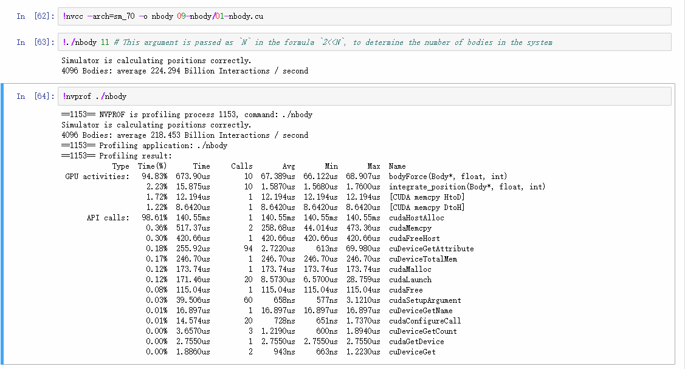
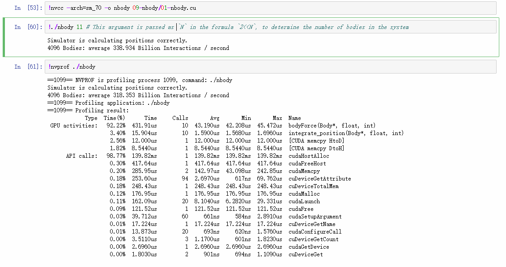
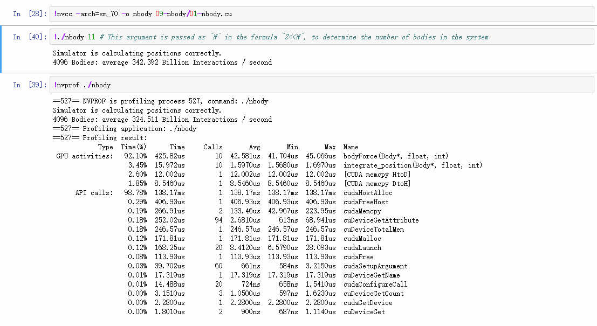

# cuda-nbody

大三下分布式并行计算实验代码，实验在Nvidia的Courses上进行，利用cuda对 nbody 算法进行优化。

网上搜索nbody的cuda优化已经有很多相应的思路介绍，我这里基于网上的各种思路实现和尝试，使用Nvidia的环境进行编写和测试，给出了最基础的并行版本和我的最终版本代码，代码中也有一定的注释说明。

因为主要是用于测试计算4096个物体时的优化，并不能保证在所有的数据量下都可以适用，思路和调参的方法也会由于不同的 GPU 和不同的数据量而有许多差别。

更多的，具体完整的调试方法还需要多多掌握相关的优化知识才行。推荐阅读《CUDA C编程权威指南》

代码中的check函数之类的是 Nvidia 平台上测试使用的。

## 优化思路如下

1. 首先将原有代码并行化，每个线程处理一个位置的body（参考[nbody_parallel.cu](./src/noby_parallel.cu)）。
2. 自己控制内存的copy，申请和释放，消除缺页异常等。（cudaMallocManaged -> cudaMalloc / cudaMallocHost）
3. 调整 BLOCK_SIZE 得到相对最佳的值（测试环境上为32）。
4. 使用 shared_memory 进行优化，一个线程块共用一块 shared_memory，每个线程取部分数据提高数据访存效率。
5. 观察 body_force 函数，发现主要处理最后为加法，故将原本的每个线程处理一个 body 进行改进，不同块中的多个线程共同处理一个 body 的数据信息，进一步提升并行率。
6. 测试了使用 shuffle 特性，但是在我测试条件下性能并没有提升且有点下降，等会会附图说明。

基本就像上面描述的，从 parallel 版本到 shared 版本改动比较多，写了一小部分注释，不太明白的可以联系我来说明。有一些优化是有一点针对性的所以不一定能通用，像shuffle版本修改 block_size 似乎就结果不正确了，因为性能不高就没有深究了。

## 测试说明
* 测试环境 V-100 信息

    

* 未加速时CPU程序性能

    

* `基础并行`版本性能
  
    

* `shuffle + 分块` 版本性能
  
    

* 使用 `shared_memory + 分块` 的性能，这里的        `BLOCK_STRIDE` 改为 `1` 即约等于原 `shared_memory` 版本的性能。
  
    

* 偷偷再加了一点针对4096个body的优化的最佳结果(测了几次得到的某一次最好的结果)
  
    
